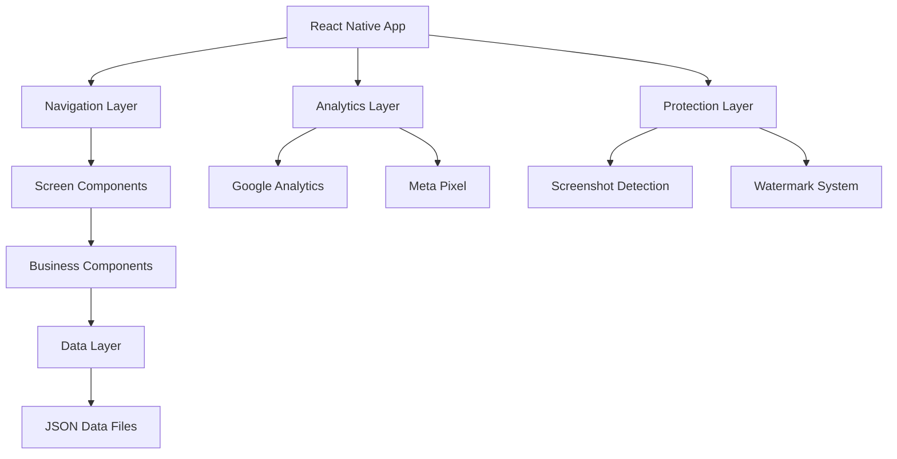

# Design Document - App Peças Compatíveis Golf MK3

## Overview

O App Peças Compatíveis Golf MK3 é uma aplicação React Native multiplataforma que oferece uma base de dados completa para proprietários de Volkswagen Golf MK3. A arquitetura é 100% frontend com dados estruturados em JSON, focando em performance, usabilidade e proteção de conteúdo.

## Architecture

### High-Level Architecture



### Technology Stack

**Core Framework:**
- React Native 0.72+ com Expo SDK 49+
- TypeScript para tipagem estática
- React Navigation 6 para navegação

**State Management:**
- React Context API para estado global
- AsyncStorage para persistência local
- Custom hooks para lógica de negócio

**UI/UX:**
- React Native Elements como base
- Styled Components para estilização
- React Native Vector Icons
- React Native Reanimated para animações

**Analytics & Marketing:**
- @react-native-firebase/analytics (Google Analytics)
- react-native-facebook-pixel (Meta Pixel)
- react-native-share para compartilhamento

**Protection:**
- react-native-screenshot-prevent
- react-native-screenshot-detector
- Custom watermark system

## Components and Interfaces

### Core Data Interfaces

```typescript
// Peças Compatíveis
interface Peca {
  id: string;
  nome: string;
  categoria: 'motor' | 'freios' | 'suspensao' | 'eletrica' | 'carroceria' | 'outros';
  modelo_golf: ('GTI' | 'GL' | 'GLX')[];
  compativel_com: CompatibilidadeInfo[];
  preco_original?: string;
  preco_compativel?: string;
  observacoes?: string;
}

interface CompatibilidadeInfo {
  veiculo: string;
  modelo: string;
  observacoes?: string;
  ano_inicio?: number;
  ano_fim?: number;
}

// Cores VW
interface CorVW {
  codigo: string;
  nome: string;
  ano: string;
  imagem_url?: string;
  disponivel: boolean;
  tipo: 'solida' | 'metalica' | 'perolizada';
}

// Fusíveis
interface Fusivel {
  posicao: string;
  amperagem: string;
  funcao: string;
  tipo: 'fusivel' | 'rele';
  localizacao: 'caixa_principal' | 'caixa_reles';
}
```

### Component Architecture

```typescript
// Screen Components
interface HomeScreenProps {
  navigation: NavigationProp<any>;
}

interface PecasScreenProps {
  navigation: NavigationProp<any>;
  route: RouteProp<any>;
}

interface CoresScreenProps {
  navigation: NavigationProp<any>;
}

interface FusiveisScreenProps {
  navigation: NavigationProp<any>;
}

// Business Components
interface SearchBarProps {
  placeholder: string;
  value: string;
  onChangeText: (text: string) => void;
  onFilter: () => void;
  showFilter?: boolean;
}

interface PecaCardProps {
  peca: Peca;
  onPress: (peca: Peca) => void;
  showCategory?: boolean;
}

interface CorCardProps {
  cor: CorVW;
  onPress: (cor: CorVW) => void;
  size?: 'small' | 'medium' | 'large';
}

interface FusivelMapProps {
  fusiveis: Fusivel[];
  onFusivelPress: (fusivel: Fusivel) => void;
  mapType: 'principal' | 'reles';
}
```

### Navigation Structure

```typescript
// Main Tab Navigator
type MainTabParamList = {
  Home: undefined;
  Pecas: undefined;
  Cores: undefined;
  Fusiveis: undefined;
};

// Stack Navigators
type PecasStackParamList = {
  PecasList: { categoria?: string };
  PecaDetail: { peca: Peca };
  PecaSearch: { query?: string };
};

type CoresStackParamList = {
  CoresGrid: undefined;
  CorDetail: { cor: CorVW };
};

type FusiveisStackParamList = {
  FusiveisMap: undefined;
  FusivelDetail: { fusivel: Fusivel };
};
```

## Data Models

### JSON Data Structure

**pecas.json:**
```json
{
  "version": "1.0.0",
  "last_updated": "2024-01-01T00:00:00Z",
  "categorias": [
    {
      "id": "motor",
      "nome": "Motor",
      "icone": "engine-outline",
      "cor": "#DC2626"
    }
  ],
  "pecas": [
    {
      "id": "velas-palio-16v",
      "nome": "Velas",
      "categoria": "motor",
      "modelo_golf": ["GTI"],
      "compativel_com": [
        {
          "veiculo": "Fiat Palio",
          "modelo": "1.6 16v",
          "observacoes": "Compatibilidade total"
        }
      ],
      "preco_original": "R$ 120,00",
      "preco_compativel": "R$ 45,00"
    }
  ]
}
```

**cores.json:**
```json
{
  "version": "1.0.0",
  "last_updated": "2024-01-01T00:00:00Z",
  "anos": ["1994", "1995", "1996", "1997", "1998", "1999"],
  "cores": [
    {
      "codigo": "LA1Z",
      "nome": "Light Sahara Sand",
      "ano": "1994",
      "imagem_url": "https://i693.photobucket.com/albums/vv299/kylealmost/001.jpg",
      "disponivel": true,
      "tipo": "solida"
    }
  ]
}
```

**fusiveis.json:**
```json
{
  "version": "1.0.0",
  "last_updated": "2024-01-01T00:00:00Z",
  "mapas": [
    {
      "tipo": "caixa_principal",
      "imagem": "mapa_fusiveis.png",
      "dimensoes": { "width": 800, "height": 600 }
    }
  ],
  "fusiveis": [
    {
      "posicao": "F1",
      "amperagem": "10A",
      "funcao": "Luzes de posição",
      "tipo": "fusivel",
      "localizacao": "caixa_principal",
      "coordenadas": { "x": 100, "y": 150 }
    }
  ]
}
```

### Data Processing Strategy

1. **Data Loading:**
   - Lazy loading por seção
   - Cache em AsyncStorage
   - Validação de integridade via hash

2. **Search Implementation:**
   - Índice invertido para busca rápida
   - Fuzzy search para tolerância a erros
   - Filtros combinados com busca textual

3. **Performance Optimization:**
   - Virtualização de listas longas
   - Memoização de componentes pesados
   - Compressão de imagens

## Error Handling

### Error Categories

```typescript
enum ErrorType {
  NETWORK_ERROR = 'NETWORK_ERROR',
  DATA_CORRUPTION = 'DATA_CORRUPTION',
  PERMISSION_DENIED = 'PERMISSION_DENIED',
  SCREENSHOT_VIOLATION = 'SCREENSHOT_VIOLATION',
  ANALYTICS_ERROR = 'ANALYTICS_ERROR'
}

interface AppError {
  type: ErrorType;
  message: string;
  details?: any;
  timestamp: number;
  userId?: string;
}
```

### Error Handling Strategy

1. **Data Errors:**
   - Fallback para dados em cache
   - Retry automático com backoff exponencial
   - Notificação discreta ao usuário

2. **UI Errors:**
   - Error boundaries para componentes críticos
   - Graceful degradation de funcionalidades
   - Logs detalhados para debugging

3. **Security Violations:**
   - Alertas imediatos ao usuário
   - Logging para monitoramento
   - Bloqueio temporário se necessário

### Error Recovery

```typescript
class ErrorRecoveryService {
  static async handleDataError(error: AppError): Promise<void> {
    switch (error.type) {
      case ErrorType.DATA_CORRUPTION:
        await this.reloadDataFromSource();
        break;
      case ErrorType.NETWORK_ERROR:
        await this.enableOfflineMode();
        break;
      default:
        await this.logErrorAndContinue(error);
    }
  }
  
  static async reloadDataFromSource(): Promise<void> {
    // Implementar reload de dados
  }
  
  static async enableOfflineMode(): Promise<void> {
    // Ativar modo offline com dados em cache
  }
}
```

## Testing Strategy

### Testing Pyramid

1. **Unit Tests (70%):**
   - Funções utilitárias
   - Hooks customizados
   - Serviços de dados
   - Componentes isolados

2. **Integration Tests (20%):**
   - Fluxos de navegação
   - Integração com AsyncStorage
   - Analytics tracking
   - Sistema de busca

3. **E2E Tests (10%):**
   - Fluxos críticos do usuário
   - Funcionalidades principais
   - Proteção de conteúdo
   - Performance em dispositivos reais

### Test Implementation

```typescript
// Unit Test Example
describe('SearchService', () => {
  it('should filter pecas by category', () => {
    const pecas = mockPecasData;
    const result = SearchService.filterByCategory(pecas, 'motor');
    expect(result).toHaveLength(5);
    expect(result.every(p => p.categoria === 'motor')).toBe(true);
  });
});

// Integration Test Example
describe('PecasScreen Navigation', () => {
  it('should navigate to detail when peca is pressed', async () => {
    const { getByTestId } = render(<PecasScreen />);
    const pecaCard = getByTestId('peca-card-0');
    
    fireEvent.press(pecaCard);
    
    await waitFor(() => {
      expect(mockNavigation.navigate).toHaveBeenCalledWith('PecaDetail', {
        peca: expect.any(Object)
      });
    });
  });
});
```

### Performance Testing

1. **Load Testing:**
   - Tempo de inicialização < 3s
   - Navegação entre telas < 500ms
   - Busca em tempo real < 200ms

2. **Memory Testing:**
   - Uso de memória < 100MB
   - Sem vazamentos de memória
   - Garbage collection eficiente

3. **Battery Testing:**
   - Otimização para economia de bateria
   - Background processing mínimo
   - Efficient rendering

### Security Testing

1. **Content Protection:**
   - Screenshot detection funcionando
   - Watermark sempre visível
   - Alertas de violação ativados

2. **Data Integrity:**
   - Validação de hash dos dados
   - Detecção de modificações
   - Logs de segurança funcionais

## Design Patterns

### Architecture Patterns

1. **Container/Presenter Pattern:**
   - Containers gerenciam estado e lógica
   - Presenters focam apenas em UI
   - Separação clara de responsabilidades

2. **Observer Pattern:**
   - Analytics events
   - Screenshot detection
   - Navigation tracking

3. **Strategy Pattern:**
   - Diferentes algoritmos de busca
   - Múltiplas estratégias de cache
   - Variações de layout por plataforma

### Code Organization

```
src/
├── components/
│   ├── containers/      # Smart components
│   ├── presenters/      # Dumb components
│   └── common/          # Shared components
├── screens/
│   ├── Home/
│   ├── Pecas/
│   ├── Cores/
│   └── Fusiveis/
├── services/
│   ├── DataService.ts
│   ├── SearchService.ts
│   ├── AnalyticsService.ts
│   └── ProtectionService.ts
├── hooks/
│   ├── useData.ts
│   ├── useSearch.ts
│   └── useProtection.ts
├── utils/
│   ├── constants.ts
│   ├── helpers.ts
│   └── validators.ts
└── types/
    ├── data.ts
    ├── navigation.ts
    └── components.ts
```

## Performance Considerations

### Optimization Strategies

1. **Bundle Optimization:**
   - Code splitting por seção
   - Tree shaking para remover código não usado
   - Compressão de assets

2. **Runtime Optimization:**
   - Lazy loading de componentes
   - Memoização com React.memo
   - Virtual lists para grandes datasets

3. **Network Optimization:**
   - Dados embarcados no app
   - Compressão de imagens
   - Preload de conteúdo crítico

### Memory Management

```typescript
// Exemplo de otimização de memória
const PecasList = React.memo(({ pecas, onPecaPress }) => {
  const renderItem = useCallback(({ item }) => (
    <PecaCard peca={item} onPress={onPecaPress} />
  ), [onPecaPress]);
  
  return (
    <VirtualizedList
      data={pecas}
      renderItem={renderItem}
      keyExtractor={item => item.id}
      removeClippedSubviews={true}
      maxToRenderPerBatch={10}
      windowSize={5}
    />
  );
});
```

## Security Considerations

### Content Protection Implementation

1. **Screenshot Prevention:**
   - Native modules para iOS/Android
   - Detecção em tempo real
   - Alertas educativos

2. **Watermarking:**
   - Overlay transparente
   - Rotação dinâmica
   - Informações de copyright

3. **Data Protection:**
   - Ofuscação em desenvolvimento
   - Validação de integridade
   - Logs seguros

### Privacy Compliance

1. **Data Collection:**
   - Apenas dados necessários para analytics
   - Anonimização de informações pessoais
   - Opt-out disponível

2. **Storage Security:**
   - Dados locais não sensíveis
   - Criptografia quando necessário
   - Limpeza automática de cache